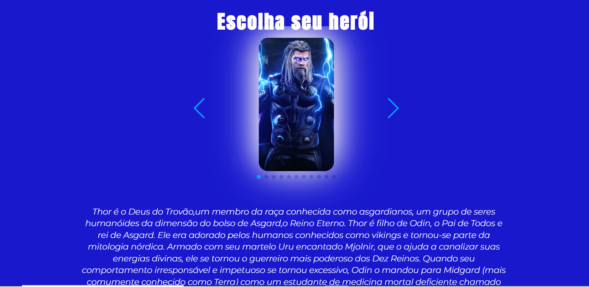

Bem vindo! 👋
 

Este projeto foi realizado em HTML, CSS, JavaScript e utilizando a lib Swipe para estilos de carrossel.

**Projeto**
Página Marvel Heroes, trazendo a história e curisosidades dos heróis da Marvel em imagens no estilo carrossel.

**Objetivo do projeto:**

Implementar estilos de carrossel juntamente com estrutura de parágrafo, visando a experiência do usuário em navegação e leitura das informações.

Have fun! 🚀
